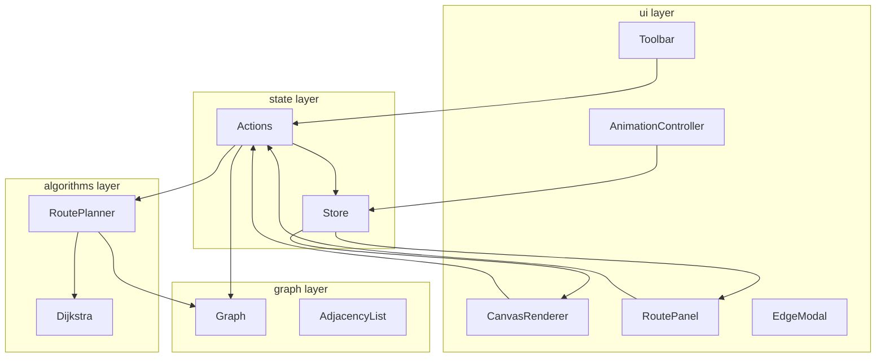

# Архитектура проекта: Визуализатор кратчайших маршрутов

**Основано на**: [concept.md](concept.md), [ui-design.md](ui-design.md), [tech-stack.md](tech-stack.md)

## Обзор

Клиентское SPA (Vite + Vanilla JS): **layered architecture** с единым **Store** в `state/`. Доменный граф — **список смежности**; кратчайшие пути — **Дейкстра** по сегментам маршрута; UI — **SVG** + CSS-анимация рёбер.



## Структура проекта

```
cursovaya/
├── index.html                 # точка входа Vite
├── package.json
├── vite.config.js
├── vitest.config.js
├── public/                    # статика (если нужна)
├── src/
│   ├── main.js                # bootstrap: Store + UI
│   ├── styles/
│   │   └── workspace.css      # стили по прототипу
│   ├── graph/
│   │   ├── Graph.js           # агрегат графа
│   │   ├── Vertex.js
│   │   ├── Edge.js
│   │   └── adjacency.js       # операции списка смежности
│   ├── algorithms/
│   │   ├── dijkstra.js        # чистая функция (from, to, graph)
│   │   └── routePlanner.js    # сегменты RoutePlan → RouteResult
│   ├── state/
│   │   ├── AppState.js        # фабрика начального state
│   │   ├── store.js           # getState / dispatch / subscribe
│   │   ├── actions.js         # addVertex, buildRoute, playAnimation…
│   │   └── toolModes.js       # константы режимов
│   └── ui/
│       ├── workspace.js       # связывает DOM и store
│       ├── canvasRenderer.js  # SVG: вершины, рёбра, подсветка
│       ├── toolbar.js         # левая панель инструментов
│       ├── routePanel.js      # правая панель, список, длина
│       ├── edgeModal.js       # модалка веса и направления
│       └── animationController.js  # «Пуск», таймер, классы рёбер
└── tests/
    ├── graph.test.js
    ├── dijkstra.test.js
    └── routePlanner.test.js
```

**Обоснование:** соответствует [tech-stack.md](tech-stack.md) (layer-first, Vite, Vitest). Тесты рядом с `src/`, без DOM для `graph/` и `algorithms/`.

## Модель данных

**Детально**: [data-model.md](data-model.md)

**Кратко:**
- **Vertex**, **Edge**, **Graph** (adjacency list)
- **RoutePlan**, **RouteResult**, **AnimationState**
- **AppState** — единый Store

## Контракты (внутренние операции)

**OpenAPI (логические, без HTTP)**: [contracts/openapi.yaml](contracts/openapi.yaml)

| Документ | Назначение |
|----------|------------|
| [graph-operations.md](contracts/graph-operations.md) | Вершины, рёбра, очистка |
| [route-operations.md](contracts/route-operations.md) | Точки маршрута, buildRoute |
| [animation-operations.md](contracts/animation-operations.md) | Пуск / стоп анимации |

**Количество логических операций:** 11 (соответствуют кнопкам и кликам в `workspace.html`).  
**REST API:** отсутствует (нет backend).

## Поток данных (Store)

1. UI событие → `actions.dispatch(type, payload)`
2. Action изменяет `graph` / `routePlan` или вызывает `routePlanner` / `dijkstra`
3. Новый `AppState` → `store.setState`
4. `store.subscribe` → `canvasRenderer.render(state)` + `routePanel.render(state)`

**Правило:** `algorithms/*` не импортирует `ui/*`.

## Внешние зависимости

### Внешние сервисы
- Нет (offline-first в браузере).

### npm-пакеты (план)
| Пакет | Назначение |
|-------|------------|
| vite | dev + build |
| vitest | unit-тесты |

### Инструменты
- Node.js 20+, npm, Git

## Принципы организации кода

- **Разделение слоёв**: graph/algorithms без DOM; ui без формул Дейкстры.
- **Единый Store**: один источник правды для рендера.
- **Чистые функции** в `dijkstra.js` — полное покрытие Vitest.
- **KISS**: без фреймворков, без лишних паттернов.
- **Соответствие прототипу**: новая кнопка → action → поле в data-model.

## Архитектурные паттерны

| Паттерн | Применение |
|---------|------------|
| **Layered architecture** | graph → algorithms → state → ui |
| **Centralized Store** | AppState + dispatch/subscribe |
| **Adjacency list** | Graph.adjacency |
| **Strategy (toolMode)** | поведение клика по активному инструменту |

## Безопасность

- Нет auth, нет сети, нет пользовательских данных на сервере.
- Валидация ввода веса на клиенте (XSS минимален при отсутствии `innerHTML` с пользовательским текстом — предпочтительно `textContent`).

## Производительность

- Дейкстра O((V+E) log V) с бинарной кучей (или O(V²) для ≤50 вершин — допустимо для курсовой).
- Перерисовка SVG: обновлять только изменённые элементы (оптимизация P2 в implement).

---

## Ключевые решения этапа

### 1. Layered + единый Store

- **Причина**: tech-stack зафиксировал layer-first; Store даёт предсказуемый рендер и простые тесты без event bus.
- **Влияние**: plan — шаги «store», «actions», затем UI; implement — `subscribe` в `main.js`.

### 2. Список смежности для Graph

- **Причина**: выбор студента; естественен для разреженных графов и Дейкстры.
- **Влияние**: `graph/adjacency.js`; неориентированное ребро = две записи в adjacency.

### 3. Внутренние контракты вместо REST

- **Причина**: нет backend; операции = действия UI из прототипа.
- **Влияние**: `contracts/openapi.yaml` как карта модулей; deploy — только статика.

---

**Статус**: Утверждено  
**Утверждено**: 21.05.2026
